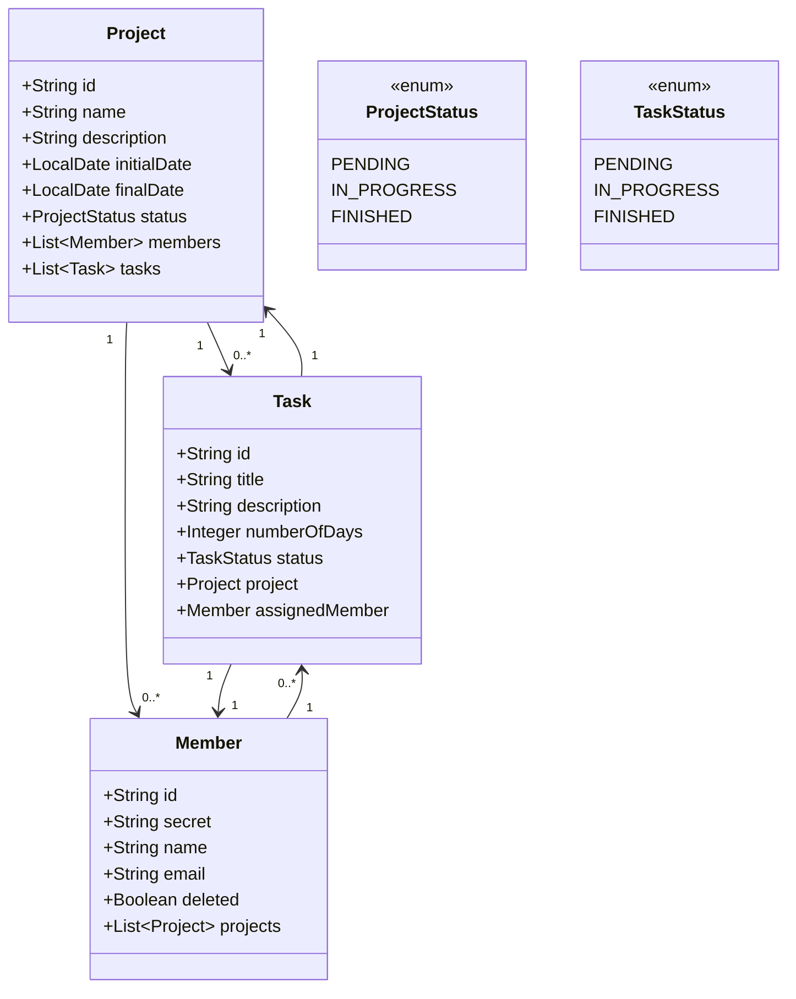

# Projeto de Gerenciamento de Projetos (ProManager)

O ProManager é um sistema desenvolvido como projeto pessoal com foco em aprendizado prático de backend. A aplicação permite gerenciar projetos, membros e tarefas de forma organizada, simulando o funcionamento de uma equipe dentro de uma empresa.

Durante o desenvolvimento, foram utilizadas tecnologias como Java e Spring Boot para construção da API, com persistência em MySQL e integração com MongoDB. O projeto também adota os princípios do DDD (Domain-Driven Design), com separação de responsabilidades e modelagem clara das entidades.

Um diagrama foi elaborado para representar visualmente as relações entre as entidades do sistema, como projetos, membros e tarefas.

## Tecnologias Utilizadas

- **Linguagem**: Java 21  
- **Framework**: Spring Boot  
- **Banco de Dados**: MySQL e MongoDB  
- **ORM**: Spring Data JPA
- **Validação**: Bean Validation
- **Outros**: Lombok, DTOs, tratamento de exceções, arquitetura DDD

## Diagrama de Classes (Domínio da API)

